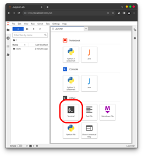
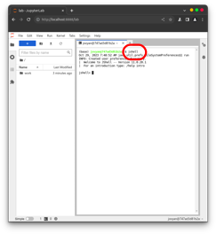
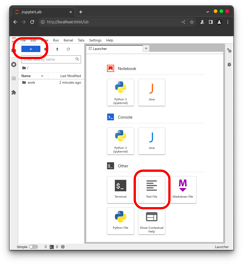
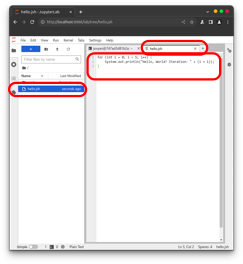
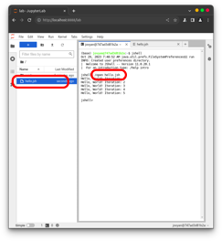
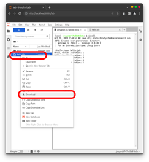

## Usage without installation

https://url.hilberg.eu/java

## Installation and usage (Debian/Ubuntu)

Install podman and deploy scripts.

```bash
curl -sL https://raw.githubusercontent.com/tna76874/podjava/main/install.sh | bash
```

#### podjava

containerized java

```bash
podjava java -version
```

#### podpod

Containerized jupyter with java

Startup

```bash
podpod
```

and open http://localhost:8888/

## Installation and usage (Windows)

Download and install latest podman release from https://github.com/containers/podman/releases

A restart of the PC is required to finish podman installation. After podman installation finished, download `startjupyter.bat` from https://raw.githubusercontent.com/tna76874/podjava/main/startjupyter.bat

Ensure, the file is NOT saved with a .txt file ending. Filename: `startjupyter.bat`

Double click `startjupyter.bat` to start the jupyter server and open in browser: http://localhost:8888/

STRG+C in the black terminal to stop server.

## Examples

Open a **terminal**.



Now, start a **jshell** inside the terminal.



Create a new **text file**.



**Rename** (right click) the text file to `hello.jsh` and **fill** the file **with content**.



Switch back to the **jshell** session inside the terminal. **Run** the jshell file.



**Save** the file to your documents by **downloading** it.


