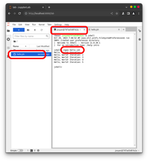

# Containerized Multiplatform Java/Python

*Lukas Meyer-Hilberg*

[https://github.com/tna76874/podjava](https://github.com/tna76874/podjava)

[PDF-Documentation](https://raw.githubusercontent.com/tna76874/podjava/main/doc/podjava.pdf)

## Usage without installation

[https://url.hilberg.eu/java](https://url.hilberg.eu/java)

## Installation and usage (Debian/Ubuntu)

Install podman and deploy scripts.

```bash
curl -sL https://raw.githubusercontent.com/tna76874/podjava/main/install.sh | bash
```

#### podjava

containerized java

```bash
podjava java -version
```

#### podpod

Containerized jupyter server with java

Startup

```bash
podpod
```

and open [http://localhost:8888/](http://localhost:8888/)

## Installation and usage (Windows)

Download and install latest podman release from [https://github.com/containers/podman/releases](https://github.com/containers/podman/releases)

A restart of the PC is required to finish podman installation. After podman installation finished, download (click right and save as) `startjupyter.bat` from [https://raw.githubusercontent.com/tna76874/podjava/main/startjupyter.bat](https://raw.githubusercontent.com/tna76874/podjava/main/startjupyter.bat)

Ensure, the file is NOT saved with a .txt file ending. Filename: `startjupyter.bat`

Double click `startjupyter.bat` to start the jupyter server and open in browser: [http://localhost:8888/](http://localhost:8888/)

STRG+C in the black terminal to stop server.

## Contributions

Contributions to this project are appreciated! Before diving in, please review the "to-dos" listed on the issue page:

[https://github.com/tna76874/podjava/issues](https://github.com/tna76874/podjava/issues)

## Examples





